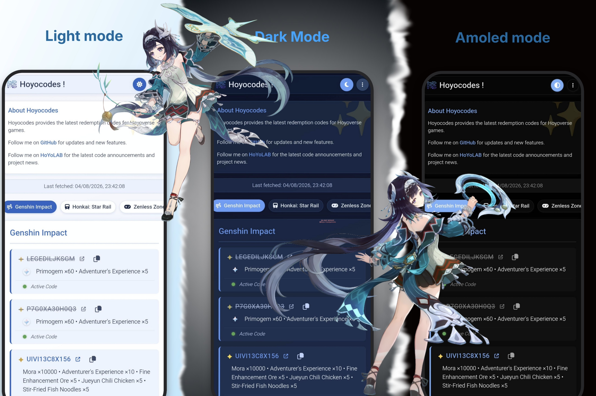

# 🌟 Hoyocodes !

[](https://opensource.org/licenses/MIT)

**Hoyocodes** is a fast, responsive, and aesthetically pleasing Progressive Web App (PWA) that automatically fetches and manages the latest active redemption codes for all major HoYoverse games. 

🔗 **Live Website:** [heartlog.github.io/Hoyocodes](https://heartlog.github.io/Hoyocodes/)

🔋 **Beta Website:** [heartlog.github.io/Hoyocodes](https://heartlog.github.io/Hoyocodes/beta)

💿 **Legacy Website:** [heartlog.github.io/Hoyocodes](https://heartlog.github.io/Hoyocodes/legacy)

---

## 🎮 Supported Games

The app dynamically fetches codes for the following titles using the [Ennead API](https://api.ennead.cc/):
- 🍃 **Genshin Impact**
- 🚆 **Honkai: Star Rail**
- 📺 **Zenless Zone Zero**
- ☄️ **Honkai Impact 3rd**
- ⚖️ **Tears of Themis**

---

## ✨ Key Features


### 🎨 UI & Design
- **Glassmorphism Aesthetics:** Clean, modern interface with blurred backgrounds and smooth transitions.
- **Dynamic Theming:** Choose between **Light**, **Dark**, and **AMOLED** modes.
- **Adaptive Color Palettes:** The UI accent colors dynamically shift to match the aesthetic of the currently selected game (e.g., Genshin Blue, Star Rail Pink/Red, ZZZ Purple).

### ⚙️ Functionality
- **Smart Redemption Tracking:** Click a code to seamlessly mark it as redeemed. Redeemed codes are crossed out and dimmed.
- **Hide Redeemed:** Toggle a setting to completely hide codes you've already claimed, keeping your feed clutter-free.
- **One-Click Actions:** Directly opens the official HoYoverse redemption website with the code pre-filled, or provides a quick-copy button for in-game-only redemptions (like Honkai Impact 3rd).

### 💾 Data Management
- **Custom Game Preferences:** Only play Genshin and ZZZ? You can hide the other games and rearrange the tab order to your liking.
- **Cloud/Local Sync:** Export your settings and redeemed code history as a JSON string, allowing you to import and sync your data across different browsers or devices.
- **Fully Offline Capable:** Built with Service Workers to ensure fast load times and PWA installability on mobile devices.

---

## 🚀 How it Works (Under the Hood)

Hoyocodes is built entirely with **Vanilla Web Technologies** (HTML, CSS, JS)—no heavy frameworks like React or Vue. 
- **Storage:** All user preferences, theme settings, and redeemed codes are saved locally using the browser's `localStorage` API. No databases or backends are required, ensuring complete user privacy.
- **Fetching:** On load, the app concurrently fetches data from the Ennead public API for all visible games and dynamically renders the DOM elements.

---

## 🛠️ Local Development

Want to modify the site or test it locally? It's incredibly simple since it's a static site.

1. **Clone the repository:**
   ```bash
   git clone [https://github.com/heartlog/Hoyocodes.git](https://github.com/heartlog/Hoyocodes.git)

 * Navigate to the directory:
   cd Hoyocodes

 * Run a local server:
   You can use VS Code's "Live Server" extension, or run a simple Python server:
   python -m http.server 8000

 * Open in browser:
   Navigate to http://localhost:8000


## 🤝 Contributing
Contributions, issues, and feature requests are welcome!
If you have an idea to improve the app:
 * Fork the project
 * Create your feature branch (`git checkout -b feature/AmazingFeature`)
 * Commit your changes (`git commit -m 'Add some AmazingFeature'`)
 * Push to the branch (`git push origin feature/AmazingFeature`)
 * Open a `Pull Request`

## 👤 Author
heartlog
 * 🐙 GitHub: [@heartlog](https://github.com/heartlog/)
 * 🌐 HoYoLAB: [My HoYoLAB Profile](https://m.hoyolab.com/#/accountCenter/postList?id=449295506)

## 📝 License
This project is open-source and available under the standard `MIT License`.

© 2026 [heartlog](https://github.com/heartlog)

